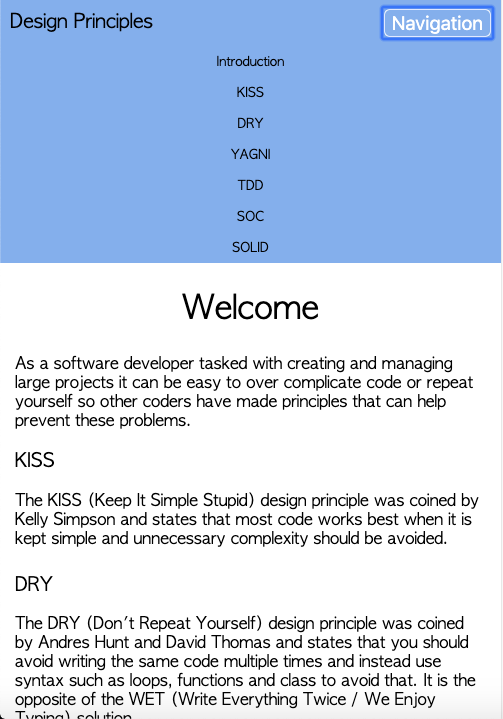
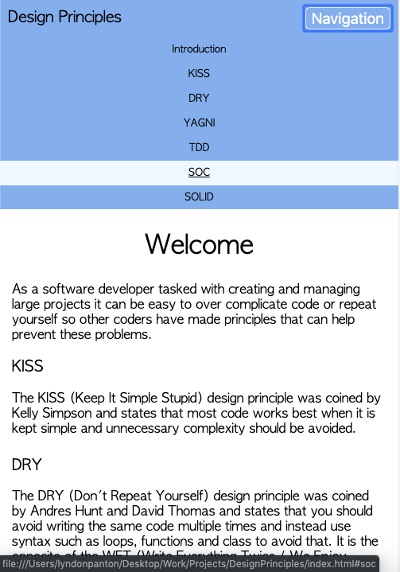
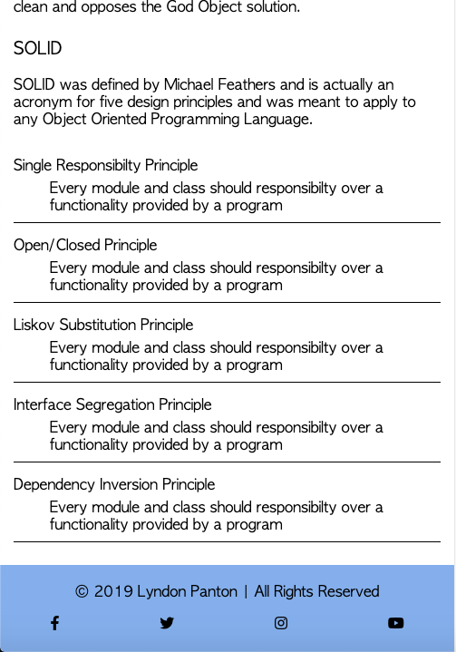
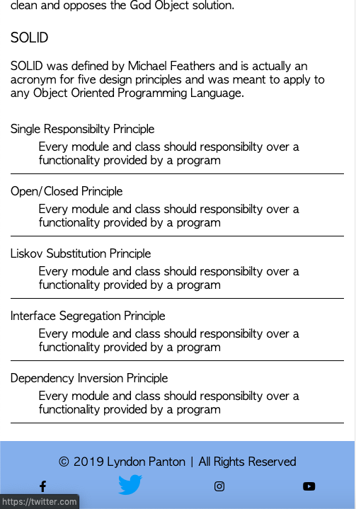

# Design Principles

## How To Open
> 1. Go to the project's folder
> 2. Right click on the file named _index.html_
> 3. Choose the _open with_ option
> 4. Open the project in your desired browser

## How To Use
> 1. Press the _Navigation Button_ to toggle the navigation menu
> 2. Read the listed design principles
> 3. Try and implement the principles in your new and existing projects

## Requirements
> 1. This project requires a browser to run
> 2. The navigation menu and copyright information require JavaScript to be available and enabled to function properly

## User Stories
> 1. Users can toggle navigation menu
> 1. Users can read design principles

## Preview

